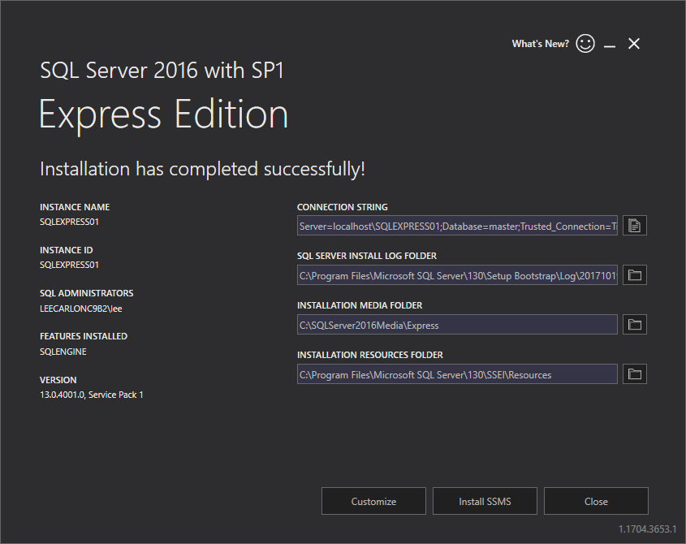
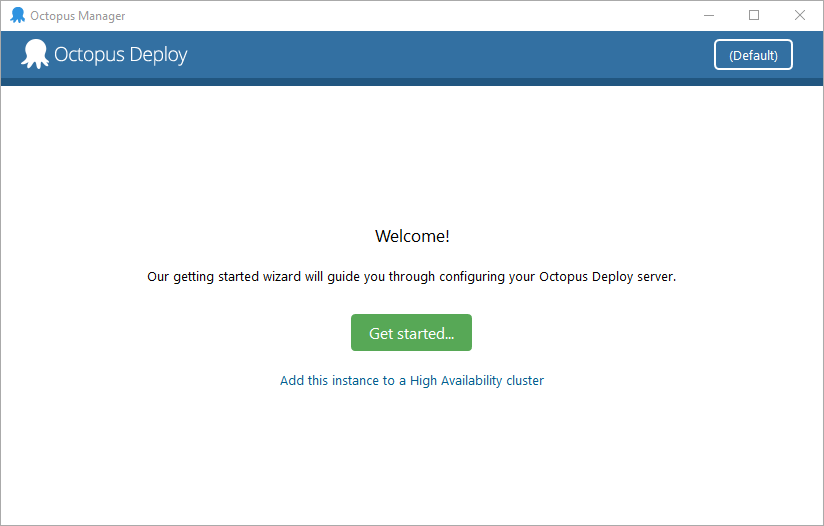
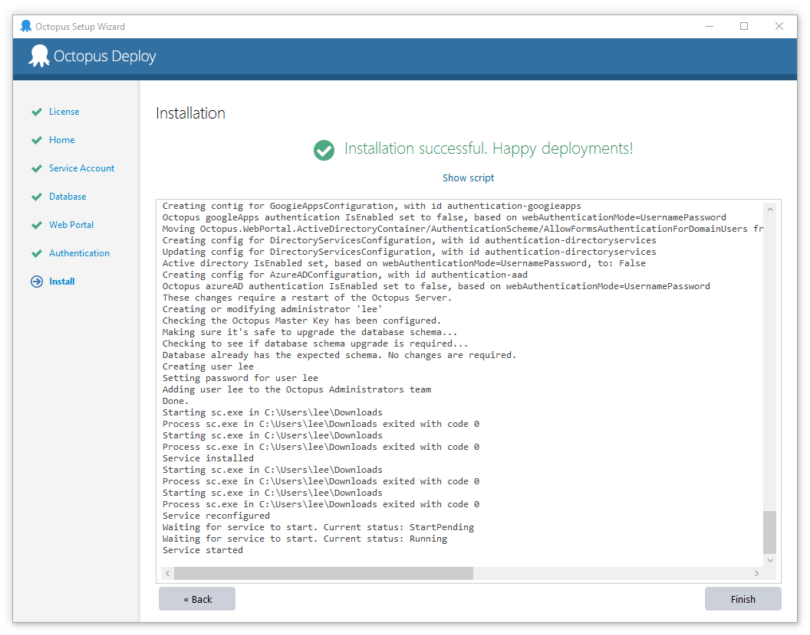

This section walks you through setting up your trial version of Octopus Deploy on Windows 10. In this quick-start, we will install:

* Octopus Deploy Server
* SQL Server Database

### What you need

You need to download:

* [Octopus Deploy Server](https://octopus.com/downloads)
* [SQL Server Express](http://www.hanselman.com/blog/DownloadSqlServerExpress.aspx)

For the purposes of this quick-start, we’re using SQL server express.

### Install SQL Server

First, we’ll install the SQL Server Database.

1. Start the SQL installer.
1. Allow the app to make changes to your device.
1. Select **Basic Installation**.
1. Accept the license.
1. Specify the installation location (We’re accepting the default).
1. Click **install** and let the installer run until it reports “Installation has completed successfully”.

We’ll let Octopus configure the database in the next step.

### Install Octopus Deploy Server

1. Start the Octopus installer that you downloaded earlier.
1. Click **next** in the installation wizard and then accept the license.
1. Accept the default installation location and click **install**.
1. Allow the app to make changes to your device.
1. When the installer has finished, clicked **Finish** to launch Octopus Manager.

### Register and Configure Octopus

1. In Octopus Manager, click **Get Started…**
1. Copy and paste the license from the email we sent you (if you haven’t already registered, do so in the app now, then check your email).
1. Accept the default location: *C:Octopus* and the default service account.
1. Click the dropdown next to the **Server Name** to detect the SQL Server you installed earlier.
1. Leave **Authentication** with the default **Windows Authentication**.
1. Enter a name for the database in the **Database** field. For instance, **OctopusDB**.
1. Octopus will ask if you would like to create the database, click **Ok**, and grant Octopus permission.
1. Accept the default ports for the web portal.
1. Add a username, email, and password to the authentication screen. You’ll use these to log into the web portal.
1. Click **install**. When the installation has finished you'll see the installation successful screen.

### Log into the Octopus Web Portal
The web portal is where you configure your infrastructure, define your release process, manage projects, and deploy applications.

* Log onto the Octopus Web Portal at [http://localhost:80/](http://localhost:80/) using the username and password you created during installation.

The Octopus Dashboard gives an overview of the basic Octopus workflow. Take a few minutes to read through the information.

Congratulations, you’ve successfully installed **Octopus Deploy**. In the next guide we’ll walk through the steps to [configure your infrastructure](/docs/getting-started/quick-starts/configure-your-infrastructure.md).

If you’re looking for more installation options, refer to the [Installation guide](/docs/installation/index.md).
